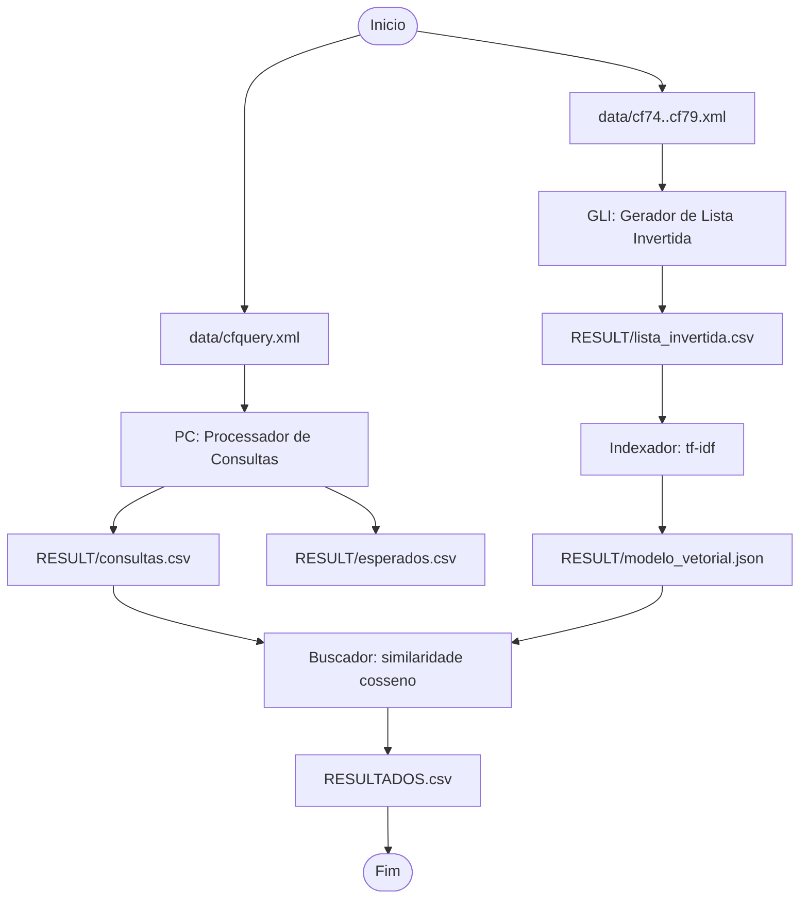

# Sistema de Recuperacao em Memoria (Modelo Vetorial)

Implementacao em Python de um sistema de Recuperacao da Informacao dividido em 4 modulos, seguindo as especificacoes do `info.pdf`.

## Estrutura

- `SRC/pc.py`: Processador de Consultas
- `SRC/gli.py`: Gerador de Lista Invertida
- `SRC/indexador.py`: Indexador Vetorial (tf-idf)
- `SRC/buscador.py`: Buscador
- `SRC/common.py`: utilitarios de configuracao, normalizacao, CSV e log
- `RESULT/`: arquivos gerados
- `logs/`: logs de execucao de cada modulo
- `MODELO.TXT`: descricao do formato salvo do modelo
- `RESULTADOS.csv`: saida final do buscador

## Dependencias

- Python 3.10+
- `nltk` (opcional, o sistema tem fallback por regex se nao estiver instalado)

## Configuracoes

Os arquivos exigidos ja estao na raiz:

- `PC.CFG`
- `GLI.CFG`
- `INDEX.CFG`
- `BUSCA.CFG`

Ajuste os caminhos para os XML reais da base CysticFibrosis2 dentro de `data/`.

## Base CysticFibrosis2 (data/)

A pasta `data/` contem os arquivos reais da colecao:

- `cf74.xml`, `cf75.xml`, `cf76.xml`, `cf77.xml`, `cf78.xml`, `cf79.xml`: documentos usados no GLI
- `cfquery.xml`: consultas usadas no Processador de Consultas
- `cfc-2.dtd` e `cfcquery-2.dtd`: definicoes DTD dos XML
- `Modern Information Retrieval - Cystic Fibrosis Collection.htm`: arquivo descritivo da colecao

Mapeamento no pipeline:

- `PC.CFG` le `data/cfquery.xml`
- `GLI.CFG` le `data/cf74.xml` ate `data/cf79.xml`
- `INDEX.CFG` consome `RESULT/lista_invertida.csv`
- `BUSCA.CFG` consome modelo e consultas processadas

## Execucao

Da raiz do projeto:

```bash
python3 SRC/pc.py --config PC.CFG
python3 SRC/gli.py --config GLI.CFG
python3 SRC/indexador.py --config INDEX.CFG
python3 SRC/buscador.py --config BUSCA.CFG
```

## Saidas esperadas

1. `RESULT/consultas.csv`
2. `RESULT/esperados.csv`
3. `RESULT/lista_invertida.csv`
4. `RESULT/modelo_vetorial.json`
5. `RESULTADOS.csv`

## Regras implementadas

- Processamento em batch (ler tudo -> processar tudo -> salvar tudo)
- Logs por modulo com inicio/fim, fases de processamento, contagens e tempos medios
- Normalizacao textual (maiusculas, sem acentos, sem pontuacao, sem `;`)
- Indexacao vetorial tf-idf
- Busca por similaridade de cosseno

## Pipeline do Sistema

A pipeline segue quatro etapas sequenciais. Primeiro, o Processador de Consultas transforma `cfquery.xml` em dois CSVs (`consultas.csv` e `esperados.csv`) com texto normalizado. Em seguida, o GLI percorre os XML de documentos (`cf74.xml` a `cf79.xml`) e gera a lista invertida com repeticao de documento por ocorrencia do termo. Depois, o Indexador converte essa lista invertida em um modelo vetorial tf-idf persistido em JSON. Por fim, o Buscador carrega modelo + consultas processadas, calcula similaridade por cosseno e grava o ranking final em `RESULTADOS.csv`.

Diagrama visual da arquitetura:



