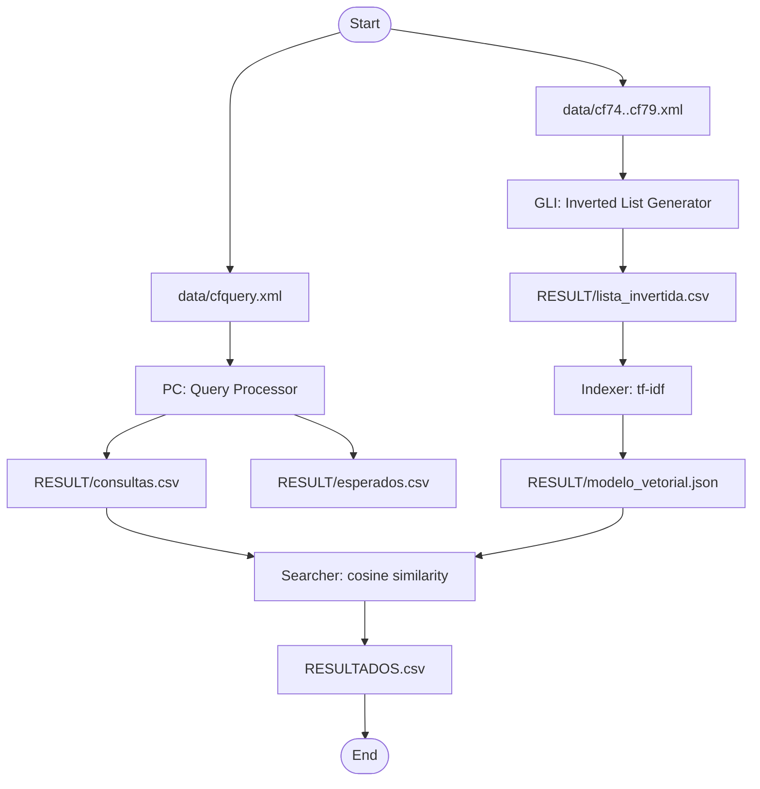

# Memory Retrieval System (Vector Model)

Python implementation of an information retrieval system divided into 4 modules, following the specifications from `info.pdf`.

## Structure

- `SRC/pc.py`: Query Processor
- `SRC/gli.py`: Inverted List Generator
- `SRC/indexador.py`: Vector Indexer (tf-idf)
- `SRC/buscador.py`: Searcher
- `SRC/common.py`: utilities for configuration, normalization, CSV, and logging
- `RESULT/`: generated files
- `logs/`: execution logs for each module
- `MODELO.TXT`: description of the saved model format
- `RESULTADOS.csv`: final search output

## Dependencies

- Python 3.10+
- `nltk` (optional; the system falls back to regex if it is not installed)

## Configuration

The required configuration files are already in the root:

- `PC.CFG`
- `GLI.CFG`
- `INDEX.CFG`
- `BUSCA.CFG`

Adjust the paths to the actual CysticFibrosis2 XML files inside `data/`.

## CysticFibrosis2 Collection (`data/`)

The `data/` folder contains the source collection files:

- `cf74.xml`, `cf75.xml`, `cf76.xml`, `cf77.xml`, `cf78.xml`, `cf79.xml`: documents used by the GLI module
- `cfquery.xml`: queries used by the Query Processor
- `cfc-2.dtd` and `cfcquery-2.dtd`: DTD definitions for the XML files
- `Modern Information Retrieval - Cystic Fibrosis Collection.htm`: dataset description file

Pipeline mapping:

- `PC.CFG` reads `data/cfquery.xml`
- `GLI.CFG` reads `data/cf74.xml` through `data/cf79.xml`
- `INDEX.CFG` consumes `RESULT/lista_invertida.csv`
- `BUSCA.CFG` consumes the model and processed queries

## Execution

From the project root:

```bash
python3 SRC/pc.py --config PC.CFG
python3 SRC/gli.py --config GLI.CFG
python3 SRC/indexador.py --config INDEX.CFG
python3 SRC/buscador.py --config BUSCA.CFG
```

## Expected outputs

1. `RESULT/consultas.csv`
2. `RESULT/esperados.csv`
3. `RESULT/lista_invertida.csv`
4. `RESULT/modelo_vetorial.json`
5. `RESULTADOS.csv`

## Implemented rules

- Batch processing (read all -> process all -> save all)
- Module logs with start/end events, processing phases, counts, and average times
- Text normalization (uppercase, no accents, no punctuation, no `;`)
- Vector indexing with tf-idf
- Search by cosine similarity

## System pipeline

The pipeline follows four sequential stages. First, the Query Processor converts `cfquery.xml` into two CSV files (`consultas.csv` and `esperados.csv`) with normalized text. Next, the GLI module scans the document XML files (`cf74.xml` to `cf79.xml`) and generates the inverted list with repeated document entries for each term occurrence. Then, the Indexer converts that inverted list into a tf-idf vector model persisted as JSON. Finally, the Searcher loads the model and processed queries, computes cosine similarity, and writes the final ranking to `RESULTADOS.csv`.

Visual architecture diagram:




## Result Analysis

The `ResultAnalysis/` folder contains analysis tools and results for evaluating the vector model's performance.

### Analysis Script
- `analyze_resultados.py`: Python script that computes ranking metrics (precision, recall, average precision, coverage) based on `RESULTADOS.csv` and relevance labels from `RESULT/esperados.csv`.

### Results Summary
The analysis evaluated 99 queries with relevance labels. Key metrics:
- Mean Precision@10: 0.435
- Mean Precision@20: 0.328
- Mean Recall@20: 0.213
- Mean Average Precision (MAP): 0.256
- Mean coverage of relevant documents: 0.974
- Minimum coverage: 0.698
- Maximum coverage: 1.0
- Queries with full coverage: 56

### Example Per-Query Metrics
For query '00001' (1225 relevant documents):
- Precision@10: 1.0
- Precision@20: 1.0
- Recall@20: 0.016
- Average Precision: 0.970
- Coverage: 0.979

Detailed results are saved in `ResultAnalysis/analysis_results.txt`.
```
