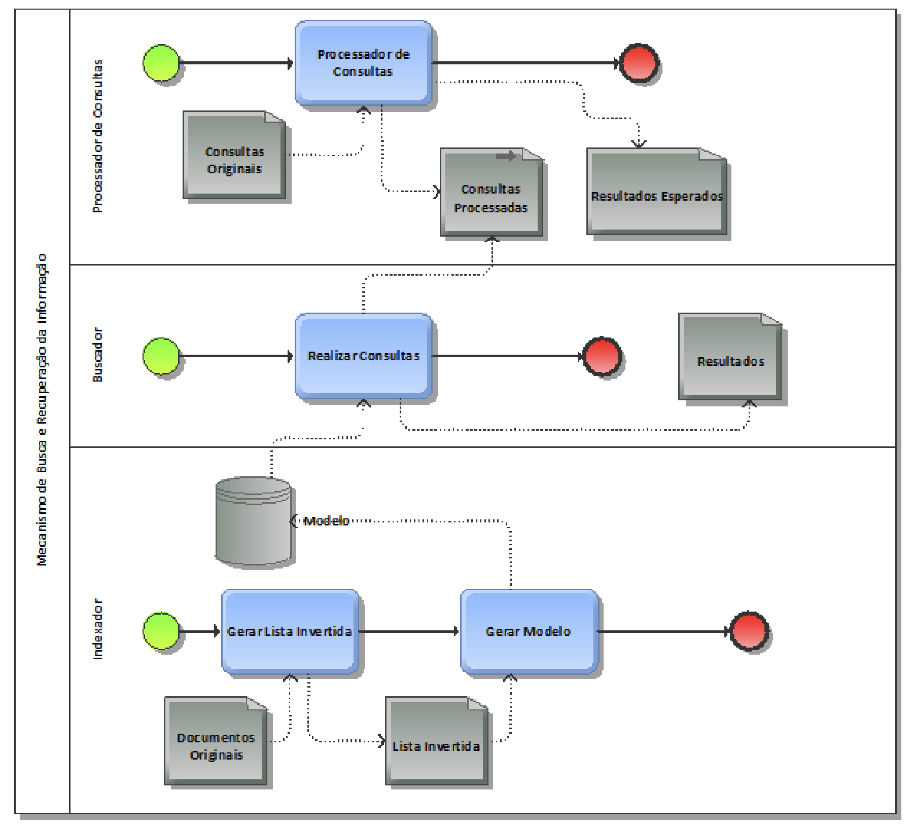

# In-Memory Information Retrieval System (Vector Space Model)

This project presents a Python implementation of an Information Retrieval system structured into four modular components, following the specifications defined in `info.pdf`.

## Project Structure

- SRC/pc.py: Query Processor
- SRC/gli.py: Inverted List Generator
- SRC/indexador.py: Vector Indexer (tf-idf)
- SRC/buscador.py: Search Module
- SRC/common.py: Utilities for configuration, normalization, CSV handling, and logging
- RESULT/: Generated output files
- logs/: Execution logs for each module
- MODELO.TXT: Description of the model storage format
- RESULTADOS.csv: Final search output

## Dependencies

- Python 3.10+
- nltk (optional; the system provides a regex-based fallback if not installed)

## Configuration

The required configuration files are already provided at the project root:

- PC.CFG
- GLI.CFG
- INDEX.CFG
- BUSCA.CFG

Users should update the file paths to point to the actual XML files from the CysticFibrosis2 collection located in the data/ directory.

## CysticFibrosis2 Dataset (data/)

The data/ directory contains the original collection files:

- cf74.xml, cf75.xml, cf76.xml, cf77.xml, cf78.xml, cf79.xml: document corpus used by the Inverted List Generator
- cfquery.xml: query set used by the Query Processor
- cfc-2.dtd and cfcquery-2.dtd: XML DTD definitions
- Modern Information Retrieval - Cystic Fibrosis Collection.htm: collection description file

Pipeline Mapping:

- PC.CFG reads data/cfquery.xml
- GLI.CFG reads data/cf74.xml through data/cf79.xml
- INDEX.CFG consumes RESULT/lista_invertida.csv
- BUSCA.CFG consumes the vector model and processed queries

## Execution

From the project root directory:

python3 SRC/pc.py --config PC.CFG
python3 SRC/gli.py --config GLI.CFG
python3 SRC/indexador.py --config INDEX.CFG
python3 SRC/buscador.py --config BUSCA.CFG

## Expected Outputs

1. RESULT/consultas.csv
2. RESULT/esperados.csv
3. RESULT/lista_invertida.csv
4. RESULT/modelo_vetorial.json
5. RESULTADOS.csv

## Implemented Features

- Batch processing (read all data → process → write all outputs)
- Module-specific logging, including start/end timestamps, processing stages, counts, and average execution times
- Text normalization (uppercase conversion, accent removal, punctuation removal, exclusion of ;)
- Vector space indexing using tf-idf
- Retrieval based on cosine similarity

## System Pipeline

The system pipeline follows four sequential stages.

First, the Query Processor transforms cfquery.xml into two CSV files (consultas.csv and esperados.csv) containing normalized textual data.

Next, the Inverted List Generator processes the document XML files (cf74.xml to cf79.xml) and produces an inverted index, allowing document repetition according to term occurrences.

Then, the Indexer converts the inverted list into a tf-idf vector space model, which is serialized and stored in JSON format.

Finally, the Search module loads the model and processed queries, computes cosine similarity scores, and outputs the ranked retrieval results into RESULTADOS.csv.


## System Architecture Diagram

Visual representation of the system architecture:



```mermaid
flowchart TD
    S([Start]) --> Q[data/cfquery.xml]
    S --> X[data/cf74..cf79.xml]

    Q --> PC[PC: Query Processor]
    PC --> C1[RESULT/consultas.csv]
    PC --> C2[RESULT/esperados.csv]

    X --> GLI[GLI: Inverted List Generator]
    GLI --> L[RESULT/lista_invertida.csv]

    L --> IDX[Indexer: tf-idf]
    IDX --> M[RESULT/modelo_vetorial.json]

    C1 --> BUS[Search Module: cosine similarity]
    M --> BUS
    BUS --> R[RESULTADOS.csv]
    R --> E([End])
